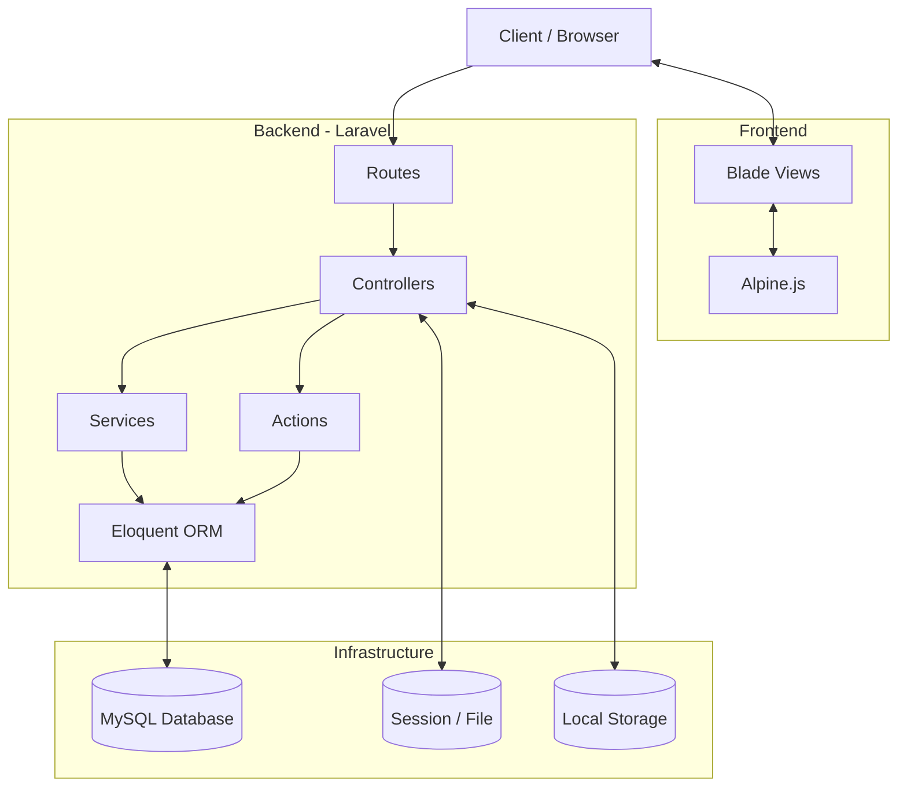

# 01 Overview

## Project Purpose
Ospekrite is an innovative marketplace platform designed specifically to streamline the procurement of university orientation (Ospek) kits and faculty-specific merchandise. It solves the logistical nightmare of distributing standard university gear by centralizing the ordering, payment, and distribution tracking process.

## Target Users
1. **New Students (Mahasiswa Baru):** Users who need to quickly and easily purchase mandatory or optional orientation gear without complex registration barriers.
2. **Administrators (Panitia/Admin):** University staff or student committee members responsible for verifying payments, managing stock, and updating order statuses upon physical distribution.
3. **Super Admins (Dewa):** System administrators with full control over the platform's configuration and data.

## Marketplace Concept
Unlike standard e-commerce platforms, Ospekrite operates on a **Campus Delivery / Pick-up Model**. Products are not shipped via third-party logistics (like JNE or J&T); instead, orders are prepared and marked as `siap_diambil` (ready for pickup) for students to collect at designated campus locations during specific orientation periods.

## Guest Checkout Philosophy
To eliminate friction for new students who may not yet have official university accounts or emails, Ospekrite embraces a **Strict Guest Checkout Philosophy**.
- **No User Registration Required:** Users do not need to create accounts or remember passwords.
- **Session & Identity Based:** Cart state is maintained via browser sessions. Order ownership and tracking are secured using a combination of the Invoice Number and the user's WhatsApp number.
- **Low Barrier to Entry:** This ensures 100% participation without technical hurdles.

## Major Features
- **Dynamic Catalog:** Browse individual products (with variants) and bundled packages.
- **Session-based Cart:** Add, update, and remove items seamlessly.
- **Frictionless Checkout:** Guest checkout with form validation and dynamic faculty options.
- **Transaction Safety:** Strict DB transactions with row-level locks (`lockForUpdate`) to prevent overselling during high-traffic spikes.
- **Flexible Payment:** Currently supports QRIS Statis with manual proof upload, architected to seamlessly transition to Dynamic QRIS (Midtrans/Xendit) in the future.
- **Secure Tracking:** Guest tracking secured by Invoice + WhatsApp verification.

## Technology Stack
- **Framework:** Laravel 11 (PHP 8.2+)
- **Frontend:** Blade Templating Engine, Alpine.js (for reactive components), Vanilla CSS (Bootstrap Icons)
- **Database:** MySQL 8.0+
- **Architecture:** Service-Repository Pattern with dedicated Action classes for complex mutations.

## Roles of Developers
- **Frontend Developer:** Responsible for Blade templates, CSS styling, responsive design, and Alpine.js micro-interactions. Focus on high-conversion UX and premium aesthetics.
- **Backend Developer:** Responsible for controllers, business logic (Services/Actions), database transactions, security, API integrations, and scheduling.
- **DevOps (Future):** Responsible for server deployment, queue workers, Redis caching, and CI/CD pipelines.

## High-Level Architecture

