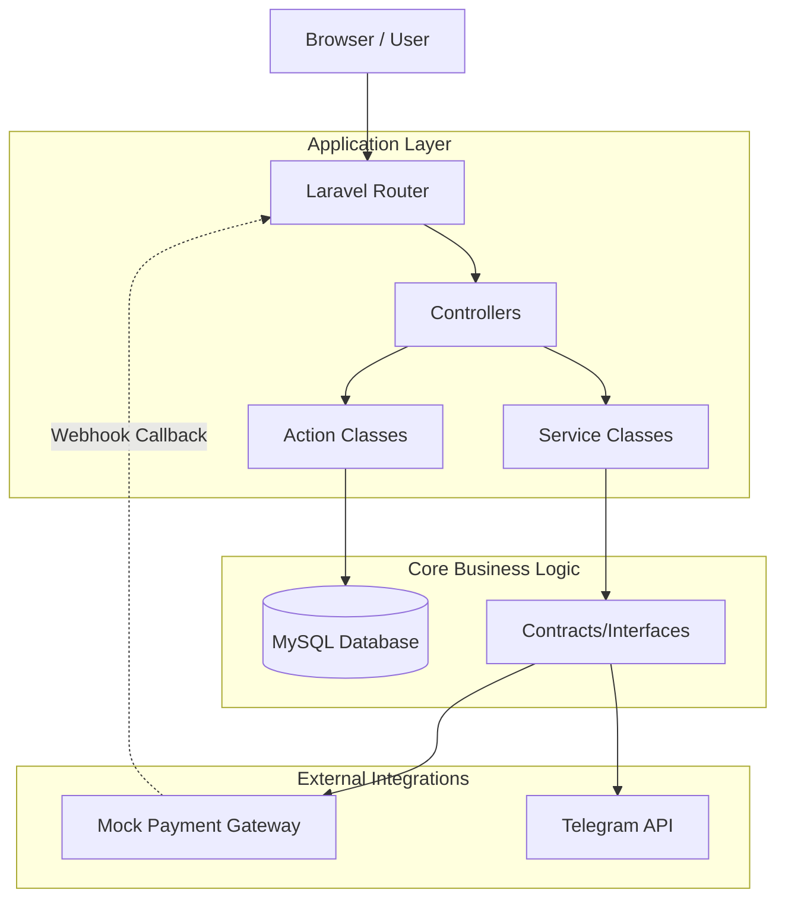

# Overview

## Project Purpose
Ospekrite is a robust, guest-checkout e-commerce marketplace built specifically to handle the ordering of university orientation (Ospek) kits. The primary goal is to provide a seamless, registration-free experience for new students to purchase their required orientation merchandise (shirts, hats, bundles) while offering an ironclad backend for the organizing committee to track, manage, and verify payments.

## Guest Checkout Philosophy
A core design decision in Ospekrite is the **Guest Checkout Model**. 
New students are often overwhelmed and asking them to create an account, verify an email, and remember a password just for a one-time purchase is an unnecessary barrier. 
Instead, Ospekrite uses a combination of **Invoice Number** and **WhatsApp Number** as the unique secure identifier to track orders. The session maintains the invoice, and if a user returns on a different device, they simply enter their Invoice and WhatsApp number to regain access to their order state.

## Core Features (Current Implementation)
- **Marketplace & Cart**: Hybrid shopping cart allowing multiple products and predefined bundles.
- **Guest Checkout**: Snapshot-based customer data recording without user accounts.
- **Stock Management**: Atomic stock deduction on checkout (Dynamic QRIS) or robust locking mechanisms.
- **Order Tracking**: Secure tracking page gated by Invoice + WhatsApp authentication.
- **Payment Abstraction**: Support for both manual (QRIS Statis with proof upload) and automated (QRIS Dinamis mock webhook) payment workflows.
- **Notifications**: Event-driven Telegram notification system for the committee.
- **Automated Expiration**: Scheduled cron job to automatically cancel unpaid orders and release locked stock.
- **Idempotency**: UUID-based idempotency keys to prevent double-billing on network retries.

## Technology Stack
- **Framework**: Laravel 11
- **Language**: PHP 8.2+
- **Database**: MySQL 8.x
- **Frontend**: Blade Templating Engine + Bootstrap 5 + Vanilla JavaScript / CSS
- **Cache & Session**: File-based (ready for Redis)

## Current Completed Stages
The project has successfully completed the following foundational and feature stages:
- **Stage 0-3**: Setup, Database, UI, Hybrid Cart.
- **Stage 4-5**: Guest Checkout, Idempotency, Transaction Locking, Tracking system.
- **Stage 6-8**: QRIS Statis upload, Expiration scheduler, Manual cancellation.
- **Stage 9**: Payment Abstraction & Mock Dynamic QRIS webhooks.
- **Stage 10**: Notification Abstraction & Telegram Integration.

## High-Level Architecture Diagram

