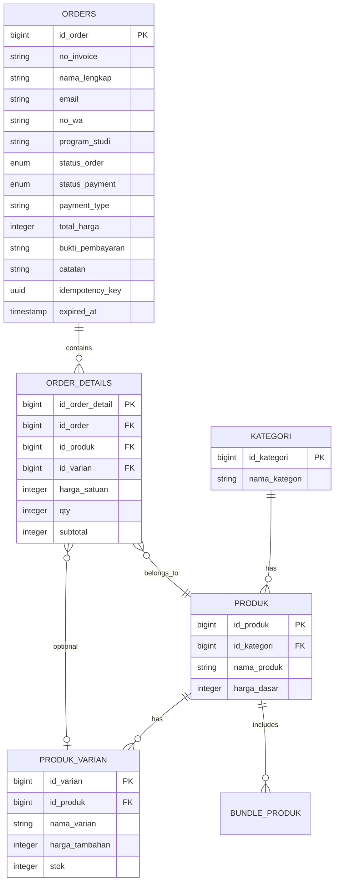

# Database Schema

## ERD (Entity Relationship Diagram)

## Tables & Important Columns

### 1. `kategoris`
Stores the categories of merchandise (e.g., "Kaos", "Topi", "Bundle").

### 2. `produks`
Stores the core product details.
- `harga_dasar`: The base price. If variants exist, their price is added to this base price.

### 3. `produk_varians`
Stores variations (like Size M, Size L) and handles the **Stock Inventory**.
- `stok`: The available quantity. Deducted atomically to prevent overselling.
- `harga_tambahan`: Added to `harga_dasar` to get the final price of this specific variation.

### 4. `orders` (The Core Transaction Table)
This table acts as a snapshot of the customer's identity and the transaction state.
- **Snapshot Customer Data**: `nama_lengkap`, `email`, `no_wa`, `program_studi`. We store these directly in the order because there is no `users` table. The order *is* the customer identity for that transaction.
- `no_invoice`: A unique human-readable string (e.g., `OSP-2026-000001`).
- `idempotency_key`: A UUID generated by the frontend form to guarantee that repeated POST requests (e.g., network timeout retries) do not result in duplicate orders.
- `payment_type`: Evaluates whether the user chose `qris_statis` (manual) or `qris_dinamis` (automated).
- `status_order` & `status_payment`: Decoupled statuses (see State Machine docs).
- `expired_at`: A timestamp set to 24 hours from creation. Used by the background cron job to cleanly cancel unpaid orders.

### 5. `order_details`
Stores the snapshot of the cart at the time of checkout.
- `harga_satuan`: We snapshot the price here so if the `produks` price changes in the future, past orders retain their historical price.

## Database Philosophy
- **Foreign Keys**: Enforced on the database level (`onDelete('cascade')` for details, `onDelete('restrict')` for critical references).
- **Snapshotting**: Prices and customer details are hard-copied into the order. This guarantees historical immutability.
