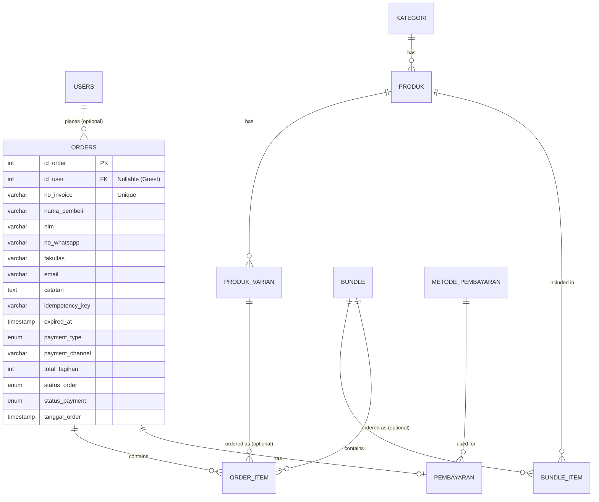

# 02 Database Architecture

## Overview
The database is designed with normal forms in mind to ensure data integrity, while strategically denormalizing specific data (like JSON snapshots in order items) to preserve historical accuracy.

## Entity Relationship Diagram (ERD)

## Tables Explanation

### 1. `users`
**Purpose:** Stores admin or super-admin accounts. Not used for guest customers.
**Key Columns:** `id_user`, `nama_lengkap`, `email`, `role` (dewa, admin, mahasiswa).

### 2. `kategori`
**Purpose:** Categorizes individual products.
**Key Columns:** `id_kategori`, `nama_kategori`.

### 3. `produk`
**Purpose:** Base table for all physical merchandise.
**Key Columns:** `id_produk`, `id_kategori`, `nama_produk`, `harga_dasar`.

### 4. `produk_varian`
**Purpose:** Stores specific sizes or types of a product, including individual stock levels and price adjustments.
**Key Columns:** `id_varian`, `id_produk` (FK), `nama_varian`, `stok`, `harga_tambahan`.
**Important:** Stock is tracked exclusively at the variant level.

### 5. `bundle` & `bundle_item`
**Purpose:** Allows grouping multiple products into a single discounted package.
**Key Columns (`bundle`):** `id_bundle`, `nama_bundle`, `harga_bundle`.
**Key Columns (`bundle_item`):** `id_bundle_item`, `id_bundle` (FK), `id_produk` (FK), `qty`.

### 6. `orders`
**Purpose:** The central transaction record.
**Columns & Philosophy:** 
- `id_user` is nullable to support the Guest Checkout Philosophy.
- Stores raw customer data (`nama_pembeli`, `nim`, `no_whatsapp`, `fakultas`) directly on the order. This is intentional denormalization to ensure the order record remains immutable even if the user later registers or changes their details.
- `idempotency_key` ensures rapid double-clicks don't create duplicate orders.
- `expired_at` allows automated schedulers to cancel unpaid orders.

### 7. `order_item`
**Purpose:** Connects orders to either products (via `id_varian`) or bundles (via `id_bundle`).
**Key Columns:** `id_order_item`, `id_order` (FK), `id_varian` (FK nullable), `id_bundle` (FK nullable), `qty`, `harga_satuan`, `detail_varian` (JSON).
**Snapshot Justification:** The `detail_varian` JSON column stores the exact name of the product and variant *at the time of purchase*. If an admin renames a product a year later, the receipt must still show the original name the customer bought.

### 8. `pembayaran`
**Purpose:** Tracks payment attempts, proofs, and statuses for an order.
**Key Columns:** `id_pembayaran`, `id_order` (FK), `bukti_transfer`, `status_pembayaran` (menunggu_validasi, lunas, ditolak), `tipe_pembayaran` (qris_statis, qris_dinamis).

### 9. `metode_pembayaran`
**Purpose:** Stores available bank accounts or static QRIS details for manual transfers.
