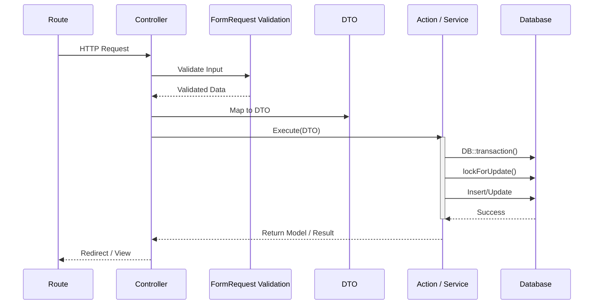

# 03 System Architecture

## Overview
Ospekrite follows a modern, robust Laravel architecture pattern that separates concerns to maintain clean controllers and highly testable business logic.

## Core Components

### 1. Controllers (`app/Http/Controllers`)
**Role:** The entry point for HTTP requests. They handle request validation (via FormRequests), call the appropriate Services or Actions, and return Views or Redirects. 
**Rule:** Controllers must NEVER contain complex business logic or raw database queries.

### 2. Services (`app/Services`)
**Role:** Handle standard business logic and data retrieval.
- `CartService`: Manages session-based cart operations safely without touching the database.
- `OrderService`: Handles querying orders, resolving cart items against the database, and calculating totals.
- `MockDynamicPaymentService`: A contract-based service demonstrating how future Midtrans/Xendit integration will seamlessly plug into the architecture.

### 3. Actions (`app/Actions`)
**Role:** Dedicated, single-responsibility classes for complex, mission-critical database mutations.
- `CreateOrderAction`: The most critical class. It wraps idempotency checks, row-level locks (`lockForUpdate`), stock validation, and multi-table inserts into a single `DB::transaction`.
- `ReleaseStockAction`: Handles returning stock to inventory when an order is cancelled or expires (prepared for dynamic payment flows).
- `UploadBuktiAction`: Handles secure file uploads and updating payment records.

### 4. DTOs (Data Transfer Objects) (`app/DTOs`)
**Role:** strongly-typed objects used to pass validated data from Controllers to Actions. 
- Example: `CheckoutDTO` ensures that `CreateOrderAction` receives exactly the parameters it expects, regardless of whether the request came from a web form or an API.

### 5. Enums (`app/Enums`)
**Role:** Type-safe representations of database ENUM columns.
- `OrderStatus` (pending, diproses, siap_diambil, selesai, batal)
- `PaymentStatus` (belum_bayar, menunggu_validasi, lunas, ditolak, expired)

## Dependency Flow



## Folder Structure

```
app/
├── Actions/          # Mission-critical mutation logic
├── Console/Commands/ # Schedulers (e.g., ExpireOrders)
├── DTOs/             # Data Transfer Objects
├── Enums/            # PHP 8.1+ Enums
├── Exceptions/       # Custom Exceptions (DuplicateCheckout, InsufficientStock)
├── Http/
│   ├── Controllers/  # Web traffic handlers
│   ├── Requests/     # Validation rules
│   └── Middleware/   # HTTP interceptors
├── Models/           # Eloquent ORMs
└── Services/         # Standard business logic & external integrations
```
