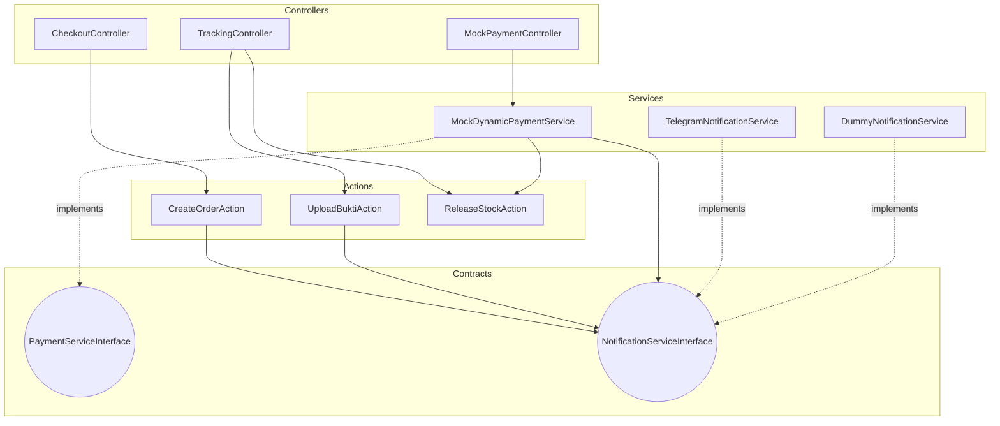

# Application Architecture

Ospekrite utilizes a modern, decoupled Laravel architecture heavily relying on **Action Classes**, **Services**, and **Contracts (Interfaces)** to separate concerns and guarantee maintainability.

## Architectural Diagram

## Layer Definitions

### 1. Controllers
Controllers in Ospekrite are kept extremely thin. Their only responsibilities are:
- Receive HTTP Requests.
- Validate data via FormRequests (e.g., `CheckoutRequest`, `TrackRequest`).
- Transform data into DTOs (Data Transfer Objects).
- Dispatch execution to Action classes or Services.
- Return HTTP Responses (redirects or views).

### 2. Action Classes
Action classes encapsulate single, complex business logic operations.
- **`CreateOrderAction`**: Handles the massive DB transaction of creating an order, snapshotting cart items, deducting stock (if applicable), and dispatching notifications. Uses `lockForUpdate` on variants.
- **`UploadBuktiAction`**: Handles secure file uploads for QRIS Statis and updating the order status.
- **`ReleaseStockAction`**: Safely restores stock to the variants when an order is cancelled or expired.

### 3. Contracts (Interfaces)
We use interfaces to strictly define how external systems should behave, adhering to the Dependency Inversion Principle.
- **`PaymentServiceInterface`**: Defines `createTransaction`, `getStatus`, and `handleCallback`.
- **`NotificationServiceInterface`**: Defines methods like `sendOrderCreated`, `sendPaymentVerified`, etc.

### 4. Services
Services implement the Contracts to interface with external APIs or complex background systems.
- **`MockDynamicPaymentService`**: Simulates a Midtrans/Xendit gateway. Handles idempotency in callbacks and updates statuses atomically.
- **`TelegramNotificationService`**: Uses Laravel's HTTP client to dispatch silent Telegram messages to the committee without disrupting the user flow.
- **`DummyNotificationService`**: A fallback service for local development that logs to `laravel.log` instead of hitting real APIs.

### 5. Dependency Injection
Bindings are managed in `AppServiceProvider`.
- Example: If `config('notification.default') == 'telegram'`, Laravel automatically injects `TelegramNotificationService` wherever `NotificationServiceInterface` is requested in the constructor. This allows zero-code changes when swapping notification providers.
