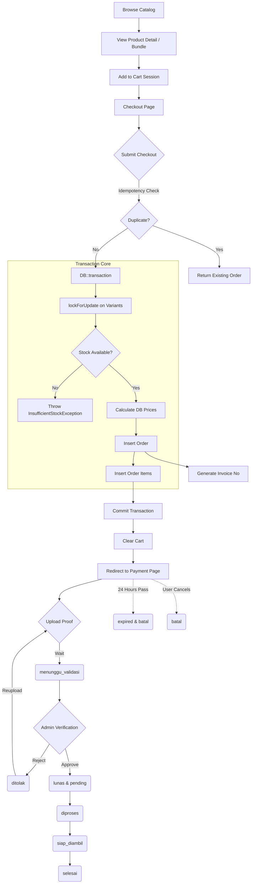

# 04 Business Flow

## Complete Lifecycle of an Order

The business logic of Ospekrite is designed to handle high concurrency during "war ticket" scenarios (thousands of students buying gear simultaneously).

## Rules and Edge Cases

### 1. Pricing Source of Truth
Never trust session data for pricing. When `CreateOrderAction` runs, it pulls the IDs from the session but recalculates all prices directly from the locked database rows to prevent tampering.

### 2. Stock Deduction Rule
Because Ospekrite currently uses QRIS Statis (manual upload), **stock is NOT deducted during checkout**. 
If stock were deducted at checkout, malicious users could add everything to their cart, checkout, and never pay, essentially freezing inventory for 24 hours.
- Stock is only officially deducted when an Admin verifies the payment and marks it as `lunas`.
- *Future Note:* When Dynamic QRIS is implemented, stock will be deducted instantly upon successful payment callback.

### 3. Concurrency (Race Conditions)
During checkout, `CreateOrderAction` uses `$query->lockForUpdate()`. If two students try to buy the last remaining jacket at the exact same millisecond, MySQL will force the second request to wait until the first transaction finishes. The second request will then see `stok = 0` and safely throw an `InsufficientStockException`.

### 4. Double Submit (Idempotency)
If a user has a slow connection and clicks the "Pay" button 5 times, a unique UUID (`idempotency_key`) is generated on the form render. The database enforces a UNIQUE constraint on this key. Subsequent clicks will safely return the original order instead of creating 5 identical invoices.
