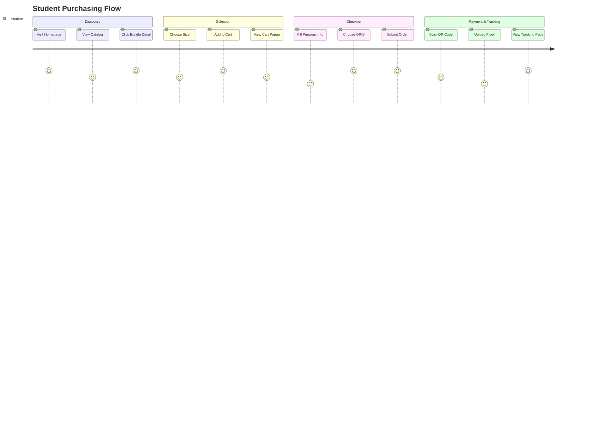

# User Flow

The User Flow documents the journey a new student takes from arriving at the website to successfully purchasing their Ospek kit. The system is designed to be completely frictionless, removing the need for user accounts.

## Customer Journey Map

## Screen-by-Screen Breakdown

### 1. Home (`/`)
Displays featured merchandise and bundles. The user can see prices and quickly navigate to details.

### 2. Product/Bundle Detail (`/produk/{id}`)
Shows descriptions, images, and a dropdown for variants (sizes). Contains the core "Add to Cart" logic which posts to the CartController and stores items in the session.

### 3. Cart (`/cart`)
A hybrid view displaying everything currently stored in the session cart. Calculates subtotals. Features a direct button to proceed to checkout.

### 4. Checkout (`/checkout`)
A single-page form where the guest user enters their snapshot data (`Nama`, `Email`, `WhatsApp`, `Prodi`). 
- Generates a hidden `idempotency_key` via UUID to prevent double submission.
- User selects either `qris_statis` or `qris_dinamis`.

### 5. Payment Page (`/pembayaran/{invoice}`)
- **If QRIS Statis**: Displays a static QR code image. Contains a file upload form for the student to upload their transfer screenshot.
- **If QRIS Dinamis**: Silently creates a transaction in the background gateway and redirects the user to the gateway's hosted checkout page. Currently routed to our internal `MockPaymentController`.

### 6. Tracking Portal (`/track`)
The central hub for guest users to revisit their order.
- **Authentication**: Requires the exact `Invoice Number` and the registered `WhatsApp Number` to access. This prevents random users from guessing an invoice URL and seeing someone else's personal data.
- **Capabilities**: 
  - View status (Lunas, Menunggu Validasi, dll).
  - Cancel order (if unpaid).
  - Re-upload proof (if rejected).
