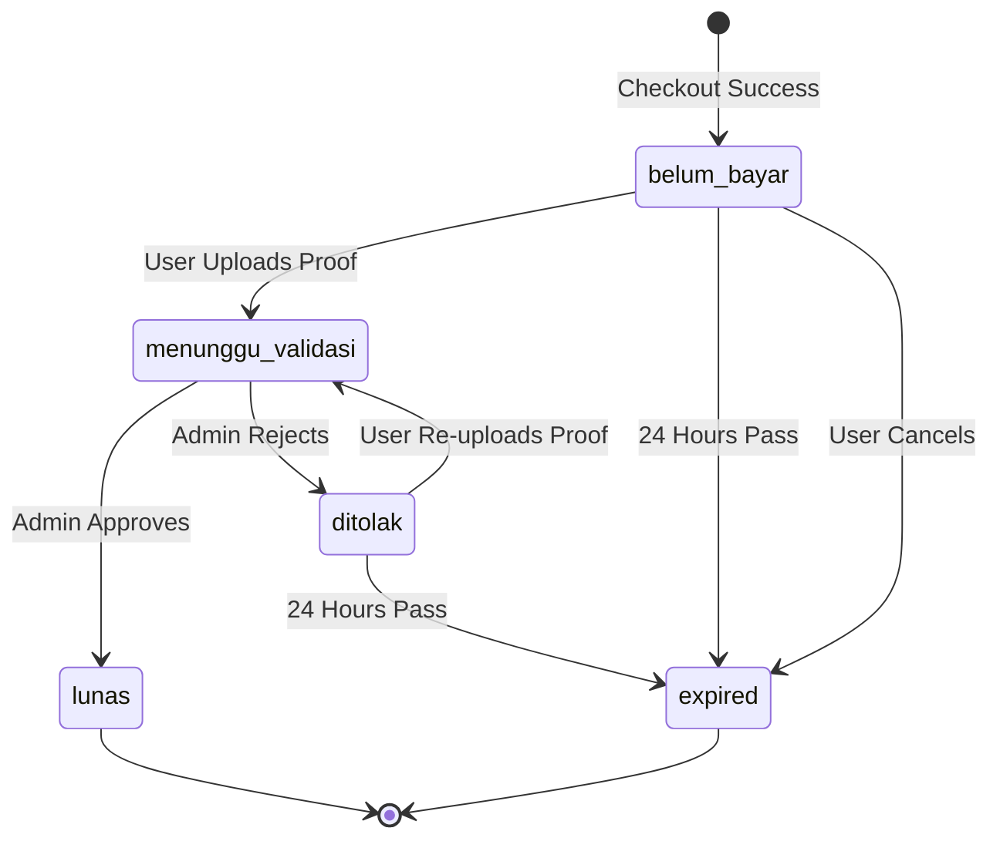
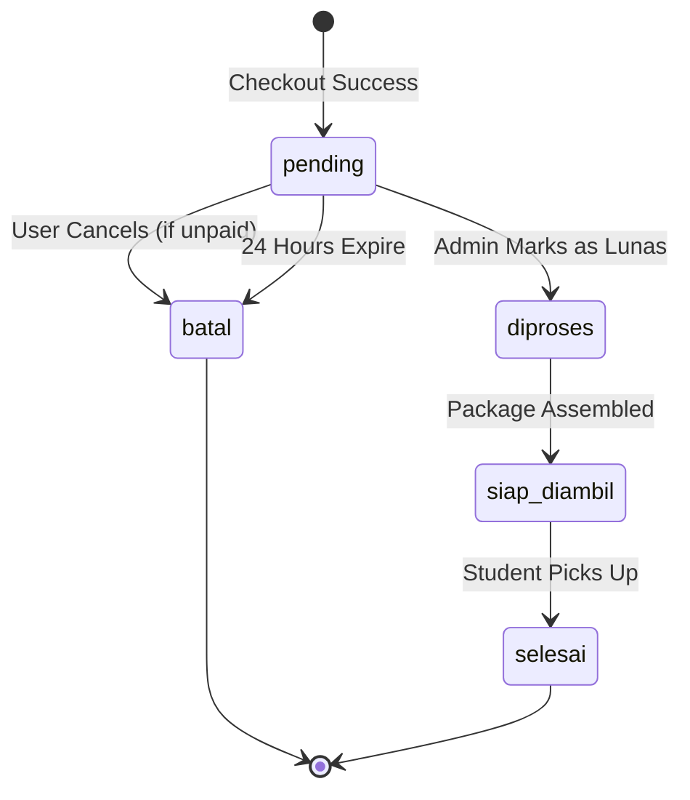

# 06 Order State Machine

## Overview
Ospekrite manages states across two distinct axes: `status_order` (physical/logistical progress) and `status_payment` (financial progress).

## 1. PAYMENT STATUS (`status_payment`)

### Definitions:
- **belum_bayar:** Initial state. Waiting for the user to upload proof.
- **menunggu_validasi:** User uploaded a file. Waiting for admin manual check.
- **lunas:** Admin confirmed funds received. (Stock is officially deducted here).
- **ditolak:** Uploaded proof is invalid, blurry, or fake. User must upload again.
- **expired:** Order timed out or user voluntarily cancelled.

---

## 2. ORDER STATUS (`status_order`)

### Definitions:
- **pending:** Order is logged but logistics hasn't started (awaiting payment).
- **diproses:** Payment is clear. The committee is physically preparing the package.
- **siap_diambil:** The package is at the campus pickup location.
- **selesai:** The student has retrieved their items. Order closed.
- **batal:** Order was cancelled manually or expired.

## Validation Rules & Invalid Transitions
1. **Cannot Process Unpaid Orders:** `status_order` CANNOT transition to `diproses` unless `status_payment` is `lunas`.
2. **Cannot Cancel Paid Orders:** Users CANNOT cancel an order if `status_payment` is `lunas` or `menunggu_validasi`.
3. **Immutability of Terminal States:** Once an order is `selesai` or `batal`, no further state changes are permitted.
