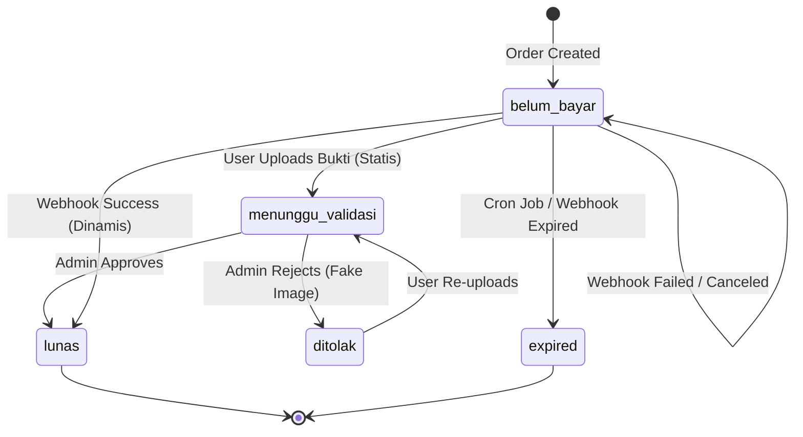
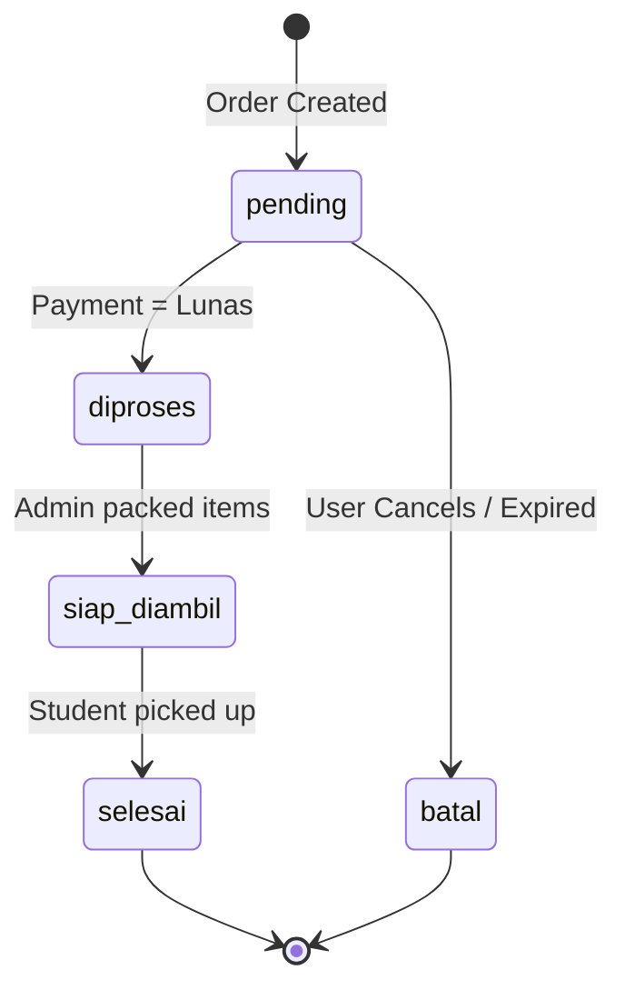

# Order State Machine

Ospekrite separates physical order progression from financial payment progression. This decoupling ensures that edge cases (like refunds or delayed shipments) are easily handled.

## Payment Status (`status_payment`)

Tracks the flow of money.

- `belum_bayar`: Initial state. Awaiting action.
- `menunggu_validasi`: (Specific to QRIS Statis) User has submitted proof, waiting for manual admin check.
- `lunas`: Payment verified. Money is secured.
- `ditolak`: Proof was invalid/unclear. User must re-upload.
- `expired`: Time ran out (24 hours).

## Order Status (`status_order`)

Tracks the physical merchandise.

- `pending`: Initial state. Waiting for payment.
- `diproses`: Automatically triggered when payment becomes `lunas`. Items are officially reserved and must be packed.
- `siap_diambil`: Package is physically ready at the pickup location.
- `selesai`: Package handed over to the student.
- `batal`: Order abandoned. Stock is released back into the pool.

## Valid vs Invalid Transitions

**Invalid**:
- Cannot move from `pending` directly to `selesai`.
- Cannot move from `batal` back to `pending`. Once cancelled, a new order must be created.
- Cannot move `status_order` to `diproses` if `status_payment` is not `lunas`.
