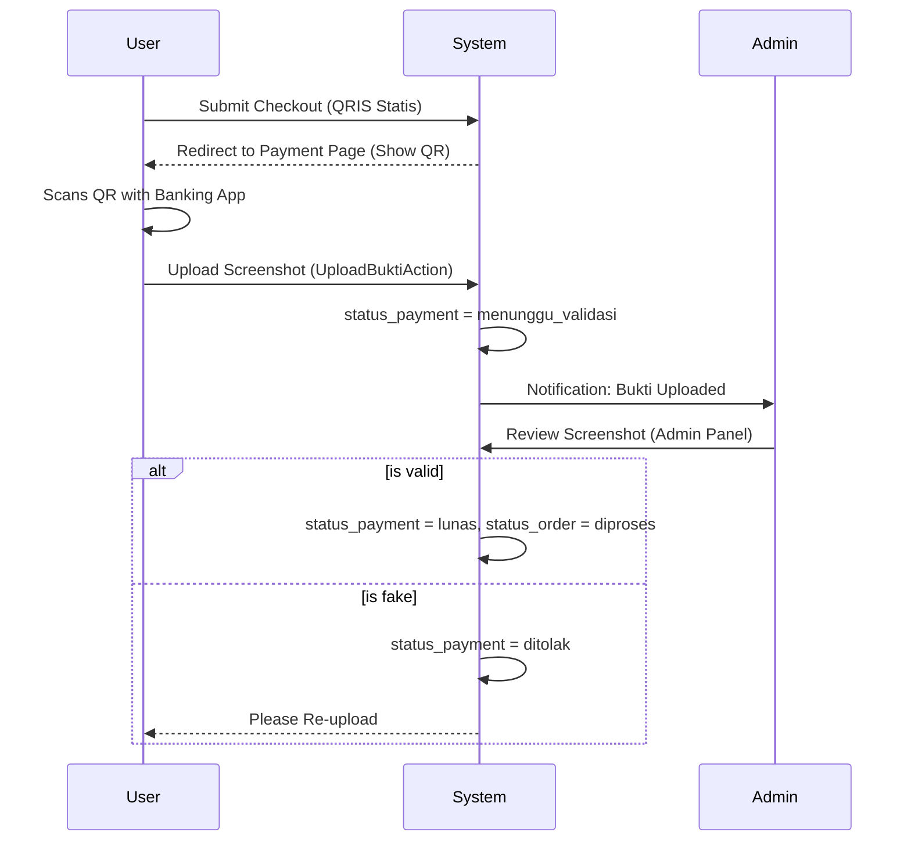
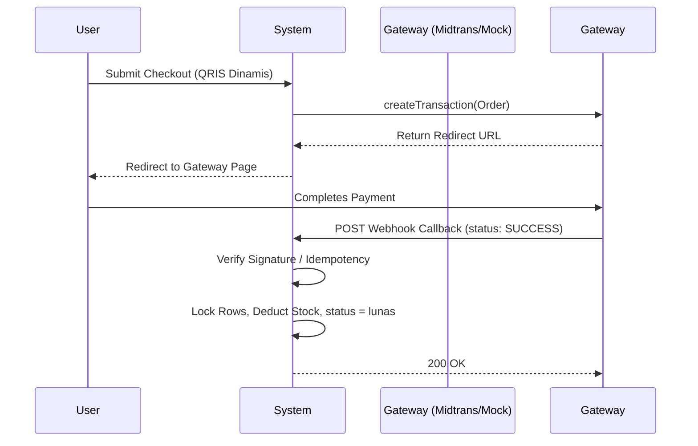
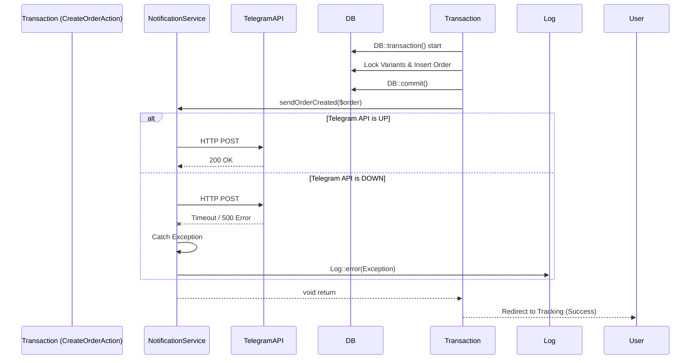

# Payment & Notification Flow

Ospekrite implements a flexible payment architecture designed to start manually and seamlessly upgrade to automated gateways in the future. Coupled with this is a robust notification abstraction system.

---

## Payment Flow

### QRIS Static (Manual)

### QRIS Dynamic (Automated Gateway)

### Payment Abstraction

To ensure controllers don't need to change when switching providers, we use `PaymentServiceInterface`.
Currently, `MockDynamicPaymentService` implements this to simulate the webhook flow locally. When ready for production, we simply create `MidtransPaymentService` and swap the binding in `AppServiceProvider`.

---

## Notification Flow

Notifications to the organizing committee are strictly decoupled from the core business transaction. **Notifications must never break the business flow.** If Telegram servers are down, the student's order must still be successfully saved and processed.

### Supported Providers
- **`TelegramNotificationService`**: Uses Laravel's HTTP client (`Http::withoutVerifying()->post()`) to hit the Bot API.
- **`DummyNotificationService`**: Fallback for local environments, simply logs the message to `laravel.log`.
- **Future Support**: Ready for WhatsApp (Fonnte/Twilio) via the same `NotificationServiceInterface`.

### Failure Handling Architecture

As demonstrated, the `try-catch` block inside the Notification Service prevents the Exception from bubbling up to the Action, thereby saving the customer from encountering a 500 Server Error just because a background notification failed to send.
