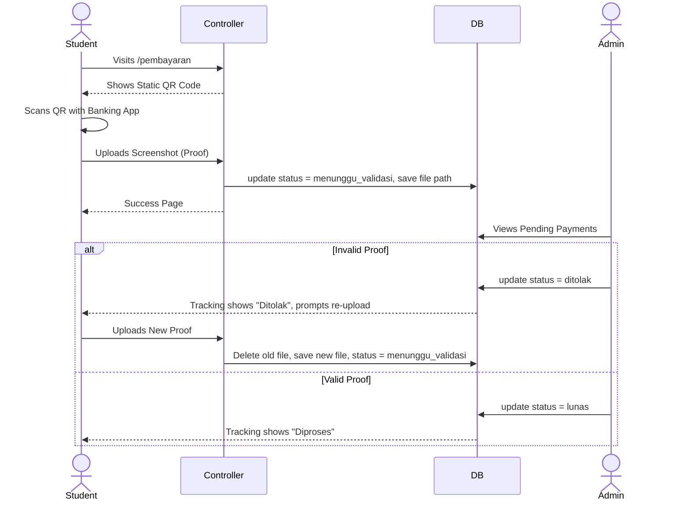

# 07 Payment Flow Architecture

## Current Implementation: QRIS Statis (Manual)

To launch quickly without waiting for corporate legal approvals required by payment gateways, Ospekrite currently uses a manual "QRIS Statis" flow. 

### Sequence Diagram

## Future Implementation: Dynamic QRIS (Midtrans/Xendit)

The system is already architected to support dynamic payments. The `MockDynamicPaymentService` exists as a contract implementation to guide future developers.

### How Dynamic Payment Works

1. **Checkout:** User submits checkout.
2. **API Call:** System calls Gateway (e.g., Midtrans) to generate a unique QR code or Virtual Account strictly tied to `total_tagihan`.
3. **Display:** System displays the dynamic QR on the payment page. No upload form is shown.
4. **Webhook:** When the user pays, the Gateway pings the Laravel Webhook endpoint asynchronously.
5. **Auto-Update:** The webhook updates the database to `lunas` and `diproses` instantly.

### Why Not Implemented Yet?
Implementing real Midtrans requires production API keys, corporate bank accounts, and legal documents (KTP/NPWP of the committee organization). The architecture is ready for it once the business side clears.
